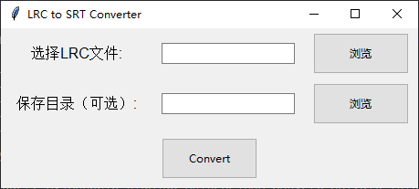

# LRC文件转SRT字幕文件


最近比较空闲，没事在做MV视频，需要将LRC格式的歌词转为SRT字幕文件，以便于剪辑视频时导入。于是就写了这么一个小工具。


### 使用方法

1. 可以直接通过运行 `gui.py ` 文件打开

```
	python gui.py
```


运行后会弹出一个窗口



选择要转换的lrc文件，点击 `convert` 转换即可。


2. 我也把它打包成exe文件了，所以可以下载[.exe文件](https://github.com/CHH3213/LRC_convert_SRT/releases/tag/v1.0)运行即可。
